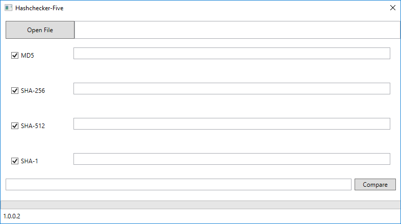

# Hashchecker-Five
Hashchecker-Five is a .NET application which can calculate and can compare checksums.

Currently, this application can handle the following algorithms: SHA-1, SHA-256, SHA-512, and MD5.

#### Quick start
Pickup a binary version [here](https://github.com/nigel5/hashchecker-five/releases)

#### Release History
* 1.0.0.1
  * First release
  * MD5, SHA-1, SHA-256, and SHA-512
  * Easily compare your checksum with the calculated checksum
  
#### License

See [LICENSE](https://github.com/nigel5/hashchecker-five/blob/master/LICENSE)
